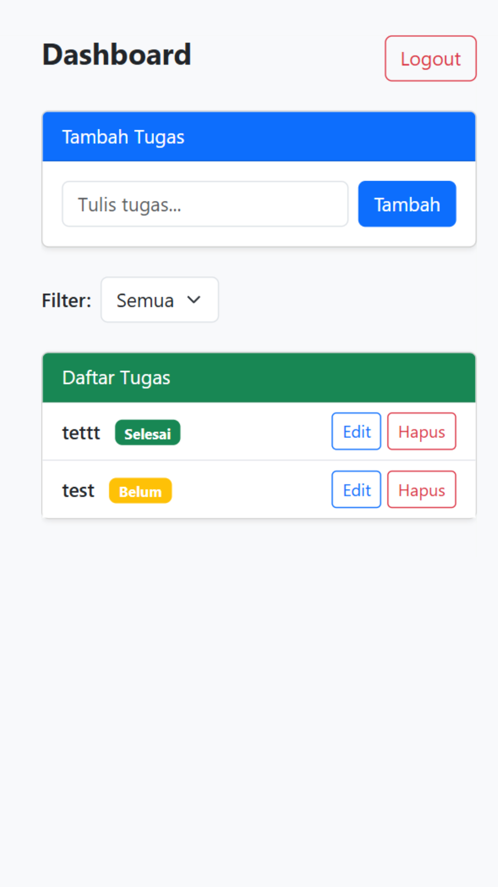

# 📝 ToDo App PHP + Bootstrap

Sebuah aplikasi to-do list sederhana berbasis PHP dan MySQL, dilengkapi dengan autentikasi pengguna, filter status tugas, dan dark mode toggle. Dibuat dengan Bootstrap agar responsif dan elegan di desktop maupun mobile.

## 🚀 Fitur Utama
- ✅ Login dan Register user
- 🗂️ Tambah, Edit, Hapus tugas
- 🔍 Filter tugas: Semua / Belum / Selesai
- 📱 Responsive design dengan Bootstrap

## 🖼️ Tampilan

### Dashboard
![Dashboard]

## 🛠️ Teknologi
- PHP (Native)
- MySQL
- Bootstrap 5
- HTML & CSS

## ⚙️ Instalasi Lokal

1. Clone repository
```bash
git clone https://github.com/username/nama-repo.git
cd nama-repo

2. Buat database dan import file todo.sql (jika ada)

3. Atur koneksi DB di config/db.php

4. Jalankan project di XAMPP / Laragon:
http://localhost/nama-folder/public/index.php


